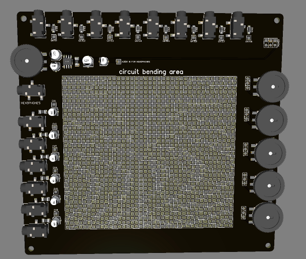

# Mushsynth-8 (Drone Synth)

Это проект полностью аналогового полифонического дрон синтезатора с сенсорной клавиатурой.

### Обновление 02.01.2023
``` 
+ Установленны кнопки вместо тумблеров.
+ Увеличен диапазон осцилляторов.
+ Исправленно направление ручек: SPEED и RESONANCE.
+ Исправленна скорость затухания DECAY.
+ Исправлена яркость светодиодов скорости LFO.
+ Оптимизирован список комплектующих.
+ Исправленна ошибка на панели.
+ Добавленны пины для подключения панели проводами.
+ Добавлены пины для удобного подключения CV и GATE разъемов.
+ Добавлены пины для внешнего управления скоростью дилея и частотой фильтра.
+ Добавлен пин для подключения внешнего аудио источника.
+ На нижнюю панель добавлени генератор Gate сигналов, счетчик и дополнительный LFO.
+ Оптимизированно подключение гнезд, увеличена макетная плата.
+ Обновлены файлы GERBER и BOM.
```


На борту:
+ 8 Генераторов звука (6 из них с выбираемой формой волны: Треугольник/Квадрат)
+ 8 Генераторов низкой частоты (LFO) на каждый из голосов для модуляции высоты звука.
+ 8 Генераторов огибающей (Envelope) на каждый из голосов для управления VCA каждого голоса.
+ 8 Сенсорных датчиков работающих в двух режимах (С фиксацией и без).
+ Генератор белого шума.
+ Микшер для управления громкостью каждого из голосов.
+ Общий фильтр низких частот (один на все голоса).
+ Общий дилей (один на все голоса).
+ Возможность подключения внешних устройств для управления с помощью CV/GATE (опционально).
+ Выход под наушники (опционально).
+ Макетная плата для дополнений или эксперементов.

Раздельная индикация работы всех блоков отображает:
+ Статус работы сенсоров либо гейта.
+ Скорость работы LFO на каждом из блоков.
+ Скорость работы Envelope на каждом из блоков.

### Что по ручкам:<p>
**Wave** — Выбор формы волны генератора (Треугольник/Квадрат).<br>
**Pitch** — Высота звука генератора.<br>
**Depth** — Глубина модуляции LFO.<br>
**Speed** — Скорость модуляции LFO.<br>
**Attack** — Скорость нарастая громкости звука.<br>
**Decay** — Скорость затухания громкости звука.<br>
**Level** — Громкость.<p>
**Noise** — Уровень громкости белого шума.<br>
**Master** — Общий уровень громкости.<p>
**Delay** — Уровень громкости дилея.<br>
**Feedback** — Уровень обратной связи дилея (количество хвостов).<br>
**Time** — Скорость дилея.<p>
**Resonance** — Усиление среза частоты.<br>
**Freq** — Частота среза фильтра.<br>

#### Ниже по ссылкам информация о том, что необходимо для сборки, как работает и другие подробности

### [Как работает](How%20it%20works/README.MD)
### [Как собрать](How%20to%20assemble/README.MD)
### [Схема в PDF](Schematic/Schematic_TouchDrone%20MK2_2022-10-09.pdf)
### [Список Комплектующих](https://github.com/EugeneCarlo/Mushsynth-8_voice_drone_synth/blob/main/BOM/README.MD)
### [GERBER - Панель](https://github.com/EugeneCarlo/Mushsynth-8_voice_drone_synth/raw/main/PCB/Gerber_PCB_Top.zip)
### [GERBER - Основная плата](https://github.com/EugeneCarlo/Mushsynth-8_voice_drone_synth/raw/main/PCB/Gerber_PCB_Mother.zip)
### [GERBER - Нижнаяя плата](https://github.com/EugeneCarlo/Mushsynth-8_voice_drone_synth/raw/main/PCB/Gerber_PCB_Low%20Mods.zip)



