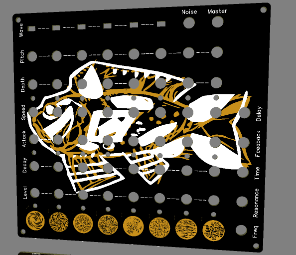

Это проект полностью аналогового полифонического дрон синтезатора.

На борту:
+ 8 Генераторов звука (6 из них с выбираемой формой волны: Треугольник/Квадрат)
+ 8 Генераторов низкой частоты (LFO) на каждый из голосов для модуляции высоты звука.
+ 8 Генераторов огибающей (Envelope) на каждый из голосов для управления VCA каждого голоса.
+ 8 Сенсорных датчиков работающих в двух режимах (С фиксацией и без).
+ Генератор белого шума.
+ Микшер для управления громкостью каждого из голосов.
+ Общий фильтр низких частот (один на все голоса).
+ Общий дилей (один на все голоса).
+ Возможность подключения внешних устройств для управления с помощью CV/GATE (опционально).
+ Выход под наушники (опционально).
+ Макетная плата для дополнений или эксперементов.

Раздельная индикация работы всех блоков отображает:
+ Статус работы сенсоров либо гейта.
+ Скорость работы LFO на каждом из блоков.
+ Скорость работы Envelope на каждом из блоков.

### [Как работает](How%20it%20works/README.MD)
### [Как собрать](How%20to%20assemble/README.MD)
### [Схема](Schematic/Schematic_TouchDrone%20MK2_2022-10-09.pdf)
### [GERBER - Панель](https://github.com/EugeneCarlo/Mushsynth-8_voice_drone_synth/raw/main/PCB/Gerber_PANEL.zip)
### [GERBER - Основная плата](https://github.com/EugeneCarlo/Mushsynth-8_voice_drone_synth/raw/main/PCB/Gerber_MOTHER.zip)
### [GERBER - Нижнаяя плата](https://github.com/EugeneCarlo/Mushsynth-8_voice_drone_synth/raw/main/PCB/Gerber_DNISHE.zip)

